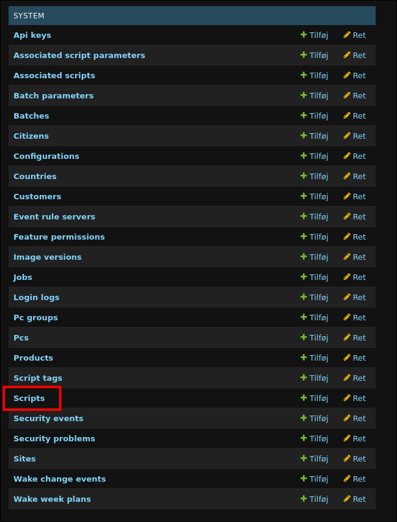
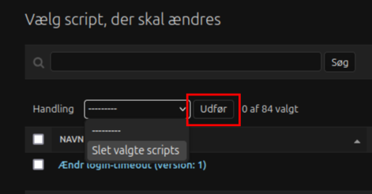

## Globale Scripts
OS2BorgerPC Admin fødes uden indhold i globale scripts. Når serveren startes befolkes globale scripts med de scripts med indholdet af [os2borgerpc-core-scripts](https://github.com/OS2borgerPC/os2borgerpc-core-scripts/releases). 

Du styrer selv hvilken version af core-script-pakken, der skal indlæses under opstart via disse to variabler:

- `CORE_SCRIPT_VERSION_TAG`: Version af de globale scripts (f.eks. `v1.0.1`).
- `CORE_SCRIPT_COMMIT_HASH`: Matchende commit-hash for versionen (f.eks. `6a96d19567bf5c002c76d16cf80f6c894c2af499`).

### Opdatering af globale Scripts
Vil man indlæse en nyere version af core-scripts er det så simpelt som at opdatere de to variable og genstarte.

1. Opdater `CORE_SCRIPT_VERSION_TAG` og `CORE_SCRIPT_COMMIT_HASH`.
  Man finder versionsnummer og commit hash øverst i [release notes for os2borgerpc-core-scripts pakken](
https://github.com/OS2borgerPC/os2borgerpc-core-scripts/releases).

2. Genstart serveren. F. eks. via
```bash
task stop
task start
```
eller

```bash
docker compose exec --user root os2borgerpc-admin python ./manage.py fetch_and_install_core_scripts --commitHash 6a96d19567bf5c002c76d16cf80f6c894c2af499 --versionTag v1.0.1
```

**Bemærk:** Eksisterende scripts fjernes ikke automatisk og skal ryddes manuelt via SQL eller `/admin`.

### Fjern ældre udgaver fra globale scripts

Globale scripts i ældre versioner kan  slettes via Djangos adminside og dermed fjernes fra script-oversigten.

Ændringerne på denne side **kan ikke fortrydes**.

1. Gå ind på Djangos adminside på path `/admin/`.\
F.eks.:\
```https://demo.os2borgerpc.dk/admin/```

2. Log ind med admin-brugeren (kun denne har adgang).

3. Tryk på `Scripts`\

4. Vælg de scripts der skal slettes ved at sætte hak ud for dem. Brug evt. søgefunktionen.\

5. Vælg `Slet valgte scripts` og tryk `Udfør` for at slette dem.\


**Bemærk:** Efter dette trin er de valgte scripts slettet permanent og kan ikke gendannes.

