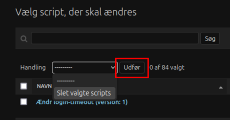

# Oprydning af gamle scripts

**ADVARSEL**\
I denne guide vises hvordan scripts fjernes ved at tilgå Djangos adminside. Django er den underliggende teknologi for OS2 Admin Site, som har sin egen adminside. Denne adminside giver ubegrænset adgang til alt data, der findes for hele ens Admin Site. Man kan derfor nemt **ødelægge sin installation**, eller **slette data for bestandigt**, hvis man ikke ved hvad man laver. **Følg derfor denne guide grundigt**, eller bestil fjernelsen af scripts hos en leverandør.\ 
De scripts der slettes vil få fjernet alle deres spor. Dette inkluderer også jobhistorik for computere hvor de indgår.

## Formål
Denne guide viser hvordan scripts slettes sikkert fra Djangos adminside. Dette kan være relevant hvis man har opdateret sine scripts til en nyere udgave, og har gamle udgaver af scripts liggende, som man ikke længere benytter, og gerne vil fjerne fra script-oversigten.

Ændringerne på denne side **kan ikke fortrydes**.

1. Gå ind på [Djangos adminside](https://docs.djangoproject.com/en/4.2/ref/contrib/admin/) på path `/admin/`.\
F.eks.:\
```https://os2borgerpc-adminsite.dk/admin/```

2. Log ind med admin-brugeren (kun denne har adgang).

3. Tryk på `Scripts`\

4. Vælg de scripts der skal slettes ved at sætte hak ud for dem. Brug evt. søgefunktionen.\

5. Vælg `Slet valgte scripts` og tryk `Udfør` for at slette dem.\


**Bemærk:** Efter dette trin er de valgte scripts slettet permanent og kan ikke gendannes.